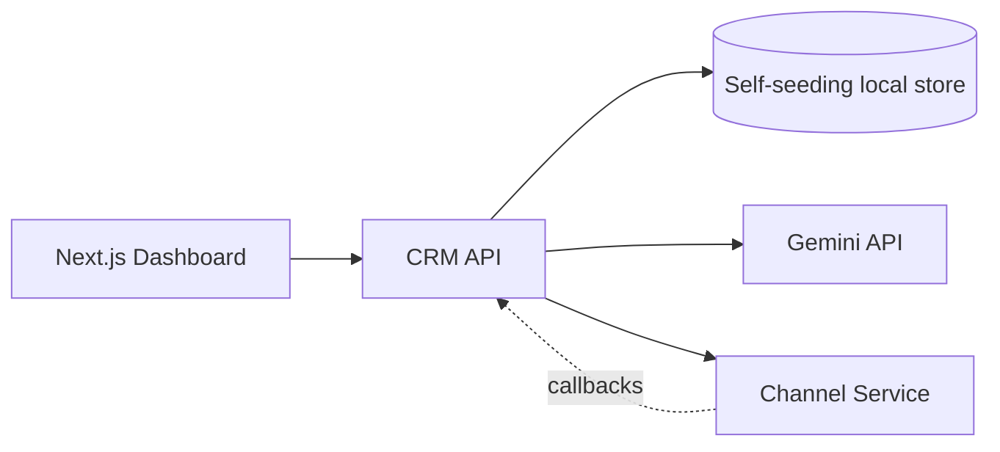

# Xeno AI Campaign Copilot

An AI-native Mini CRM for marketers to build customer audiences, generate personalized campaigns, launch simulated messaging journeys, and analyze performance.

## Architecture

- `apps/web`: Next.js 15 App Router frontend with TypeScript, TailwindCSS, shadcn-style components, dark mode, Recharts.
- `apps/crm-api`: Express.js CRM backend with a self-seeding persistent data store, Gemini-powered AI helpers, and webhook receivers.
- `apps/channel-service`: Independent Express channel service that simulates asynchronous delivery lifecycle callbacks.
- `packages/database`: shared data-layer notes and seed helper.



## Quick Start

1. Install dependencies:

```bash
npm install
```

2. Copy environment values:

```bash
cp .env.example .env
```

3. Start the app. The CRM API seeds 1000 customers and 5000 orders automatically on first boot:

```bash
npm run dev
```

4. Optional: print the seed behavior:

```bash
npm run db:seed
```

Services:

- Web: `http://localhost:3000`
- CRM API: `http://localhost:4000`
- Channel Service: `http://localhost:4100`

## Gemini

Set `GEMINI_API_KEY` in `.env`. If it is omitted, the app uses deterministic local fallbacks so the product remains fully demoable.

## Useful Scripts

- `npm run dev`: run frontend, CRM API, and channel service.
- `npm run build`: build all workspaces.
- `npm run typecheck`: TypeScript checks.
- `npm run db:seed`: print the auto-seed behavior.

## Deployment Notes

- Deploy `apps/web` to Vercel or any Node-compatible Next.js host.
- Deploy `apps/crm-api` and `apps/channel-service` as separate Node services.
- The demo data store writes to `data/xeno-store.json` by default. Set `XENO_DATA_FILE` on the CRM service to choose a persistent mounted path.
- Configure environment variables per service:
  - Web: `NEXT_PUBLIC_CRM_API_URL`
  - CRM API: `GEMINI_API_KEY`, `CHANNEL_SERVICE_URL`, `CRM_PUBLIC_URL`, optional `XENO_DATA_FILE`
  - Channel Service: `PORT`
